# NoSQL-SocialMedia-DB

### **[Description](#description) | [Installation](#installation) | [Usage](#usage) | [Credits](#credits) | [License](#license) | [Contribute](#contribute) | [Questions](#questions)**

## Description

My motivation was to build the back end for an social media site that creates and holds a database for `Users` and posts (aka `Thoughts`). There is meant to be interactability between users in forms of `friends` and `reactions` to user posts.

This creates a site that utilizes back-end features by configuring Express.js API to use Mongoose and interact with a NoSQL database. I learned a great deal on how work with json, Isomnia, NoSQL, and Mongoose. Additionally, I found these options to be better alternative to NoSQL and Sequalize. I learned to utilize CRUD methods, virtuals, getters and even got more familiar with using NPM.

## Installation

Starting the Server:
1. Fork or download repository
2. Open a terminal with `index.js`
3. In the terminal, enter `npm i`
4. Enter `npm run start`
5. Open http://localhost:3001/api/ in Insomnia (see [routes folder](./routes/api/) for specific routes)

## Usage

This project will not be deployed. Refer to the following images and associated [tutorial video file](./Assets/screen-capture-NoSQLSocialMediaDB-v2.mp4) or [tutorial video link](https://drive.google.com/file/d/1QxOnj9Ke32W6slyycdSfq5OkN-C1-Z72/view?usp=sharing). 

To see the full application working, refer to the video links provided [above](#usage). The following images demonstrate:
- GET routes for all users and all thoughts being tested in Insomnia.
- GET routes for a single user and a single thought being tested in Insomnia.
- POST, PUT, and DELETE routes for users and thoughts being tested in Insomnia.
- POST and DELETE routes for a user’s friend list being tested in Insomnia.
- POST and DELETE routes for reactions to thoughts being tested in Insomnia.

> **NOTE:** These images are taken after the changes were made (see video).

  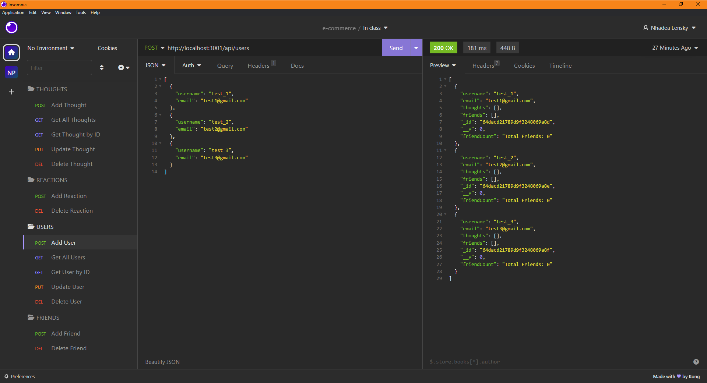
  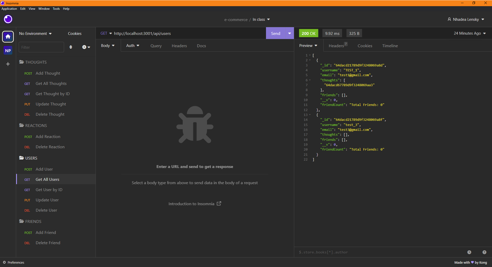
  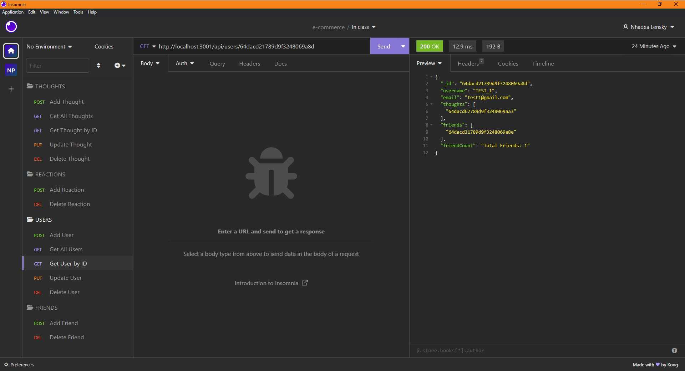
  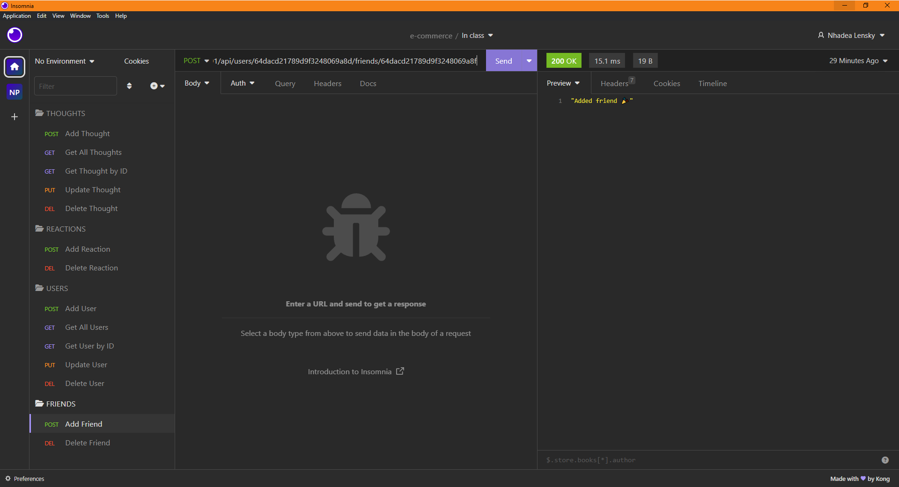
  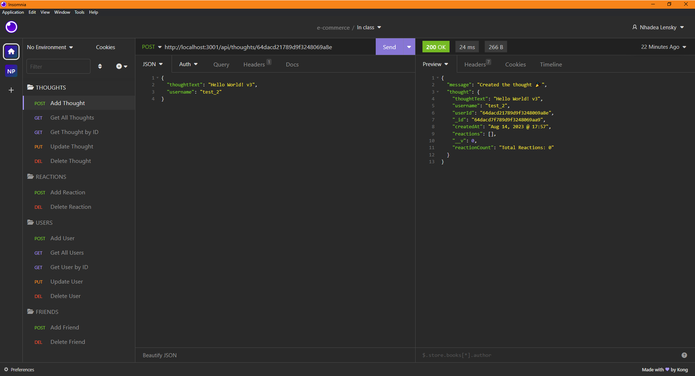
  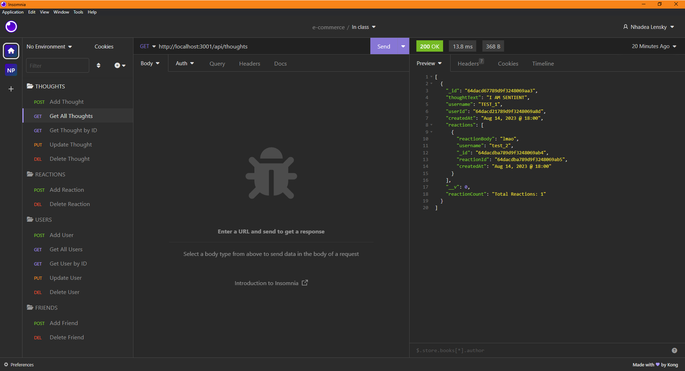
  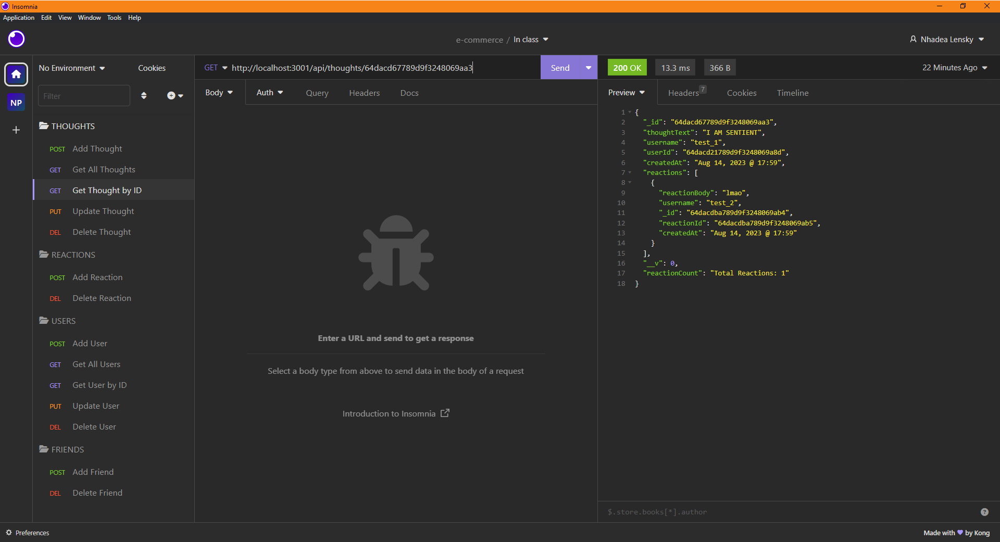
  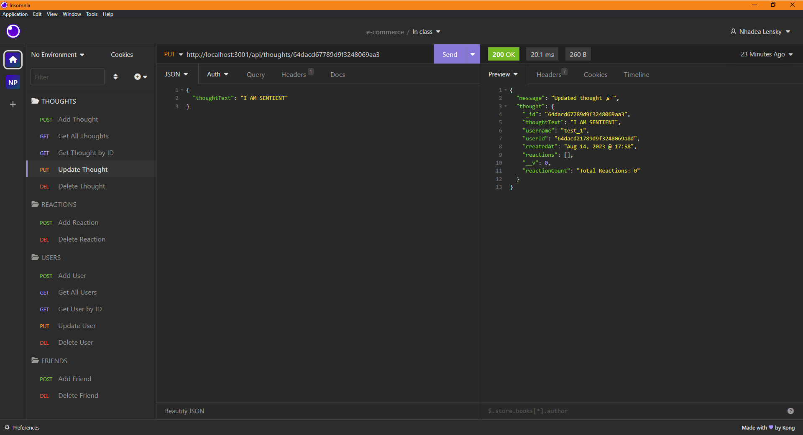
  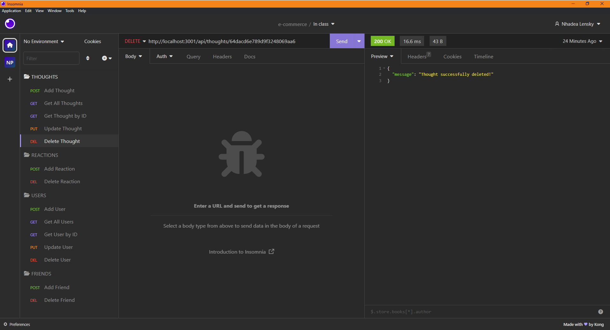
  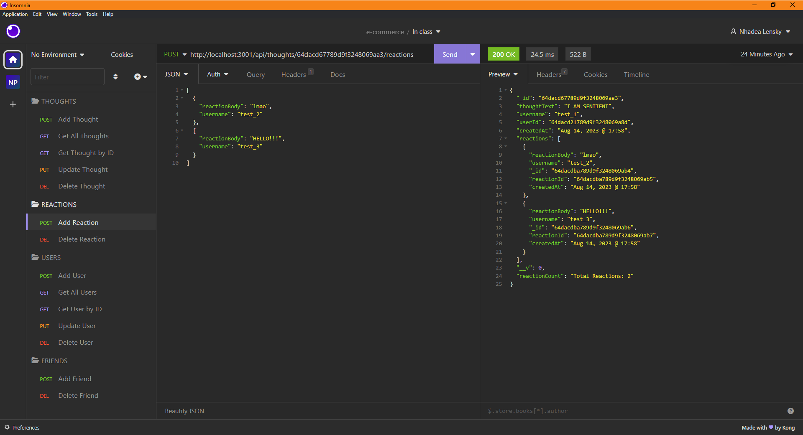
  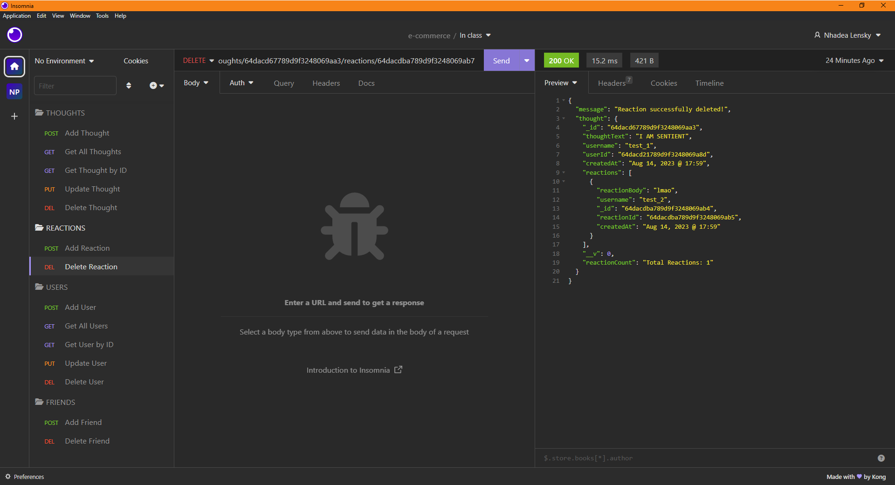
  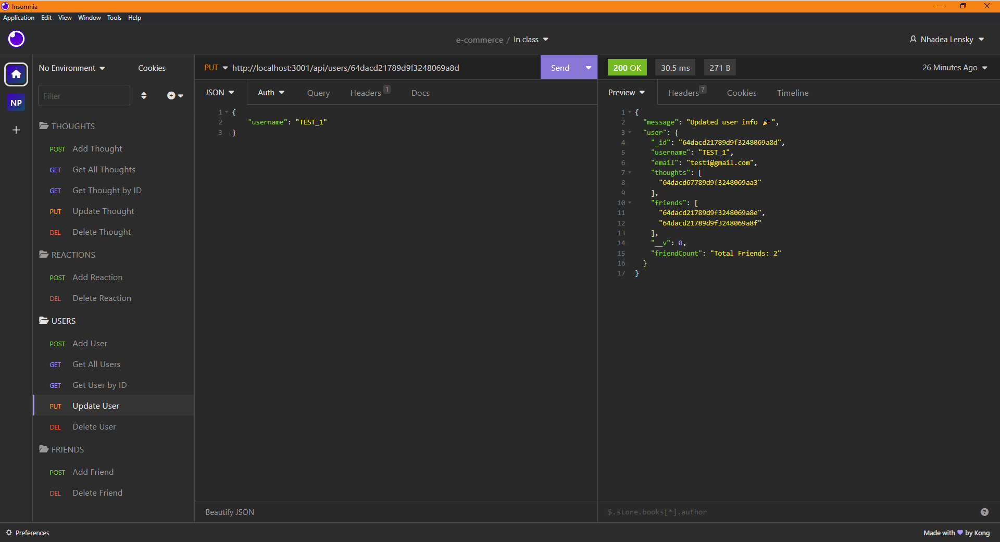
  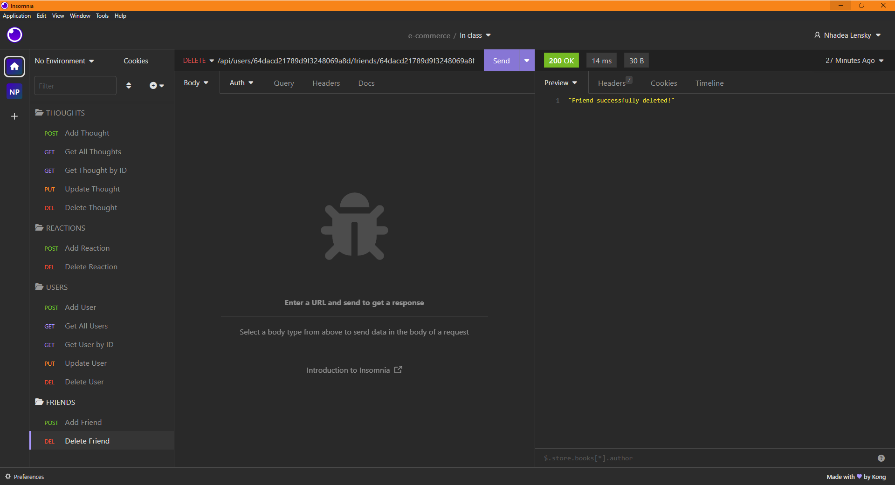
  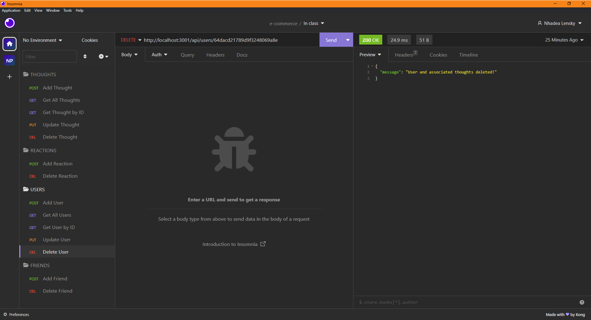

## Credits

- Collaborators: 
  - N/A.
- Third-party assets: 
  - https://expressjs.com/
  - https://day.js.org/
  - https://mongoosejs.com/
  - https://www.npmjs.com/package/mongoose-unique-validator
- Tutorials: 
  - UCSD-VIRT-FSF-PT-03-2023-U-LOLC
  - https://stackoverflow.com/questions/18022365/mongoose-validate-email-syntax
  - https://stackoverflow.com/questions/67680295/node-js-mongoose-findone-id-req-params-id-doesnt-work
  - https://stackoverflow.com/questions/69574924/express-custom-json-response
  - https://stackoverflow.com/questions/23502367/getter-and-setter-methods-in-model-class
  - https://stackoverflow.com/questions/54992810/update-many-in-mongoose
  - https://chat.openai.com/share/d53b354a-e690-47fb-a59b-6f4e303ee204
  - https://chanwingkeihaha.medium.com/do-you-know-the-unique-option-is-not-a-validator-in-mongoose-85267fb1a085
  - https://stackoverflow.com/questions/33627238/mongoose-find-with-multiple-conditions
  - https://masteringjs.io/tutorials/mongoose/updatemany

## License

 The license this application is covered under is: [MIT License](https://mit-license.org/).

## Contribute

In general, follow the "fork-and-pull" Git workflow.

  1. **Fork** the repo on GitHub.
  2. **Clone** the project to your own machine.
  3. **Commit** changes to your own branch.
  4. **Push** your work back up to your fork.
  5. Submit a **pull request** so that your changes can be reviewed.
    
  NOTE: Be sure to merge the latest from "upstream" before making a pull request!
  
  When contributing to this project, please follow the [Contributor Covenant](https://www.contributor-covenant.org/version/2/1/code_of_conduct/) code of conduct.

## Questions

My gitHub username is [itsa-me-dea](https://github.com/itsa-me-dea), and you can contact me at wachadea@gmail.com.